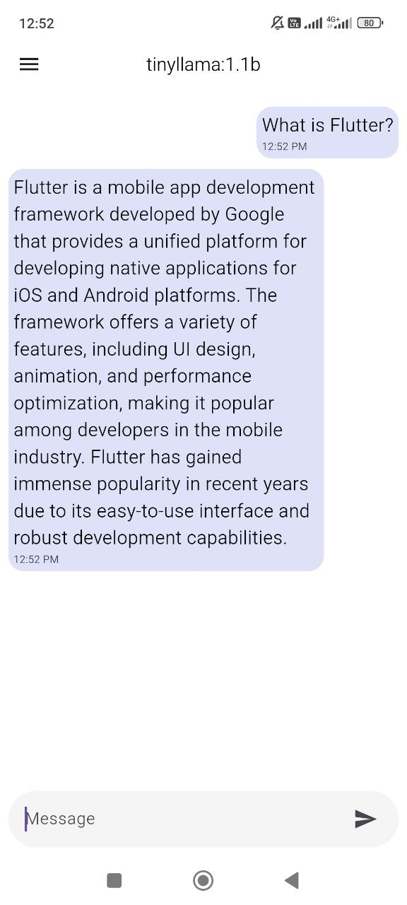
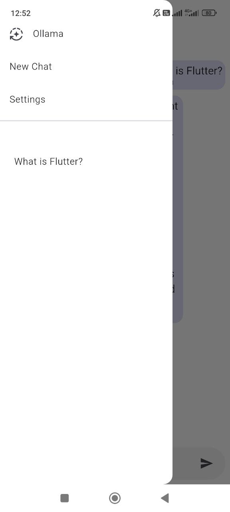
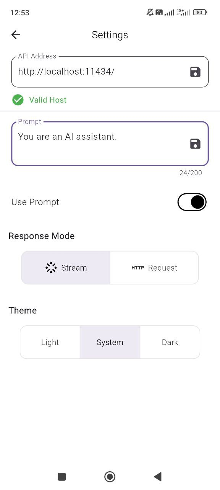

# Ollama Client App

    
    
    

A simple and convenient Android application on Flutter for interacting with a local Ollama server.

### Main features
Support for single and streaming responses from the Ollama server
Use of prompt templates (optional)
Switching between dark and light themes
Flexible and responsive interface for comfortable work

### Technologies and architecture
Flutter, MVC architecture + GetX
Isar for local data storage
Interaction with the server via the http package
Structured and maintainable code

### Project goal
Pet project created to demonstrate Flutter development skills, working with a local server and building UI/UX for real interaction with AI.
